# Om tjenesten
***NB! Denne dokumentasjonssiden er under aktiv utvikling. Beklager for evt. skrivefeil, uklarheter, lange tekster og mangel på tekst 😊 Vi tar gjerne i mot tilbakemeldinger – innspill og ønsker kan sendes på slack.***

## utsjekk
Utsjekk tilbyr tjenester innenfor utbetalingsdomenet for arbeidsytelser. Mer spesifikt kan den sende og korrigere utbetalinger, avstemme utbetalinger og gi oppdatert status på tilstanden til en utbetaling.
Se individuelle sider for dokumentasjon av hver tjeneste.

Hensikten med denne siden er å dokumentere konsepter og funksjonelle aspekter ved utsjekk sine tjenester som ikke kommer tydelig frem i API-dokumentasjonen. Er du ute etter tekniske detaljer rundt endepunktene, se Swagger-dokumentasjonen
[her](https://utsjekk.intern.dev.nav.no/swagger-ui/index.html). Videre finnes det kontrakter for alle DTO-er som utsjekk bruker i sitt API [her](https://github.com/navikt/utsjekk-kontrakter).
De aktuelle kontraktene for iverksetting ligger i artifaktet `iverksett`. Vi oppfordrer alle konsumenter til å ta i bruk kontraktene.

## Intern arkitektur

```mermaid
graph LR
    subgraph utsjekk
      iverksett["utsjekk"]
      iverksettDB[(DB)]

      iverksett --- iverksettDB
    end

    subgraph dp-oppdrag
      oppdrag["dp-oppdrag"]
      oppdragDB[(DB)]

      oppdrag --- oppdragDB
    end

    vedtak["Vedtaksløsning"]
    osur["OS/UR"]


    subgraph kafka
        topic{{helved.iverksetting-status-v1}}
    end

    vedtak -->|REST| utsjekk
    utsjekk -->|REST| dp-oppdrag
    utsjekk --> topic
    dp-oppdrag ====>|Send-kø| osur
    dp-oppdrag ====>|Kvittering-kø| osur
    dp-oppdrag ====>|Avstemming-kø| osur
```

